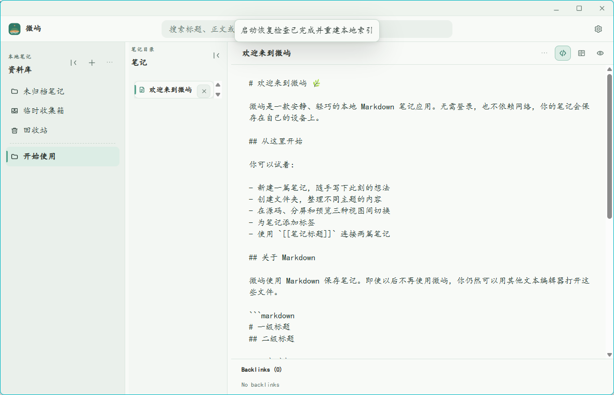

# Cay（微屿）

一个本地优先、轻量的 Markdown 笔记应用。Cay（微屿）不要求登录，也不依赖网络，笔记内容保存在自己的设备上。



## 核心特点

- 本地优先：离线即可使用，Markdown 文件是可长期保存的内容。
- 资料库管理：通过文件夹组织笔记，支持搜索、标签和笔记间链接。
- 三种编辑视图：源码、分栏和预览，适合快速记录与整理。
- 临时便签：先快速捕捉想法，再整理为正式笔记。
- 安全恢复：删除内容进入回收站，可在需要时恢复。
- 轻量界面：温暖、圆润、低干扰，适合长时间阅读和写作。

## Windows 安装

前往 [Windows v1.0.0 Release](https://github.com/Tiome-tt/weiyu-cay/releases/tag/windows-v1.0.0) 下载安装包。

- `weiyu-cay_1.0.0_x64-setup.exe`：普通用户推荐，双击即可安装。
- `weiyu-cay_1.0.0_x64_en-US.msi`：适合 Windows Installer、企业部署或静默安装。

两个安装包安装的是同一个 Cay（微屿）1.0.0 Windows 版本，请选择一个即可，不需要同时安装。当前安装包未进行商业代码签名，首次运行时 Windows SmartScreen 可能提示未知发布者。

### SHA256

- EXE：`C856433D2FEEB9D97F630D0D417081B11893FE335C1A9A0E90BF6F7A54AAAB25`
- MSI：`A7A71DA0A13E7B903AA86F77E369A97CE5067B0FD84B728CFBF9435D7647E084`

## 从源码运行

```powershell
pnpm install
pnpm tauri dev
```

常用检查命令：

```powershell
pnpm typecheck
pnpm test
pnpm tauri build
```

## 项目状态

当前公开版本为 Windows 1.0.0 预发布版。项目仍在持续完善中，欢迎通过 [Issues](https://github.com/Tiome-tt/weiyu-cay/issues) 反馈问题或建议。
