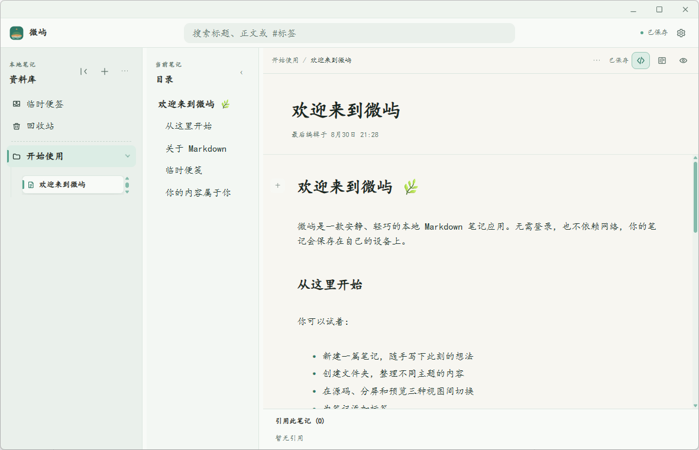

# Cay（微屿）

一个本地优先、轻量的笔记应用。Cay（微屿）不要求登录，也不依赖网络，笔记内容保存在自己的设备上。支持 Markdown 与富文档笔记，并可在资料库中管理多种格式的文件。



上图为 v1.1.1 的历史界面示意；当前版本与下载入口见下方。

## 核心特点

- 本地优先：离线即可使用，Markdown 文件是可长期保存的内容。
- 富文档笔记：支持标题、行内格式、列表、任务、链接、图片、表格和单元格合并。
- 文档整理：支持正文对齐、字体与字号、标题层级编辑、目录折叠，以及表格横向滚动和直接选中。
- 多格式兼容：可导入纯文本、PDF、图片和 DOCX；PDF 与图片可直接预览，DOCX 可转换为可编辑文档。
- 资料库管理：通过文件夹组织笔记，支持搜索、标签和笔记间链接。
- 三种编辑视图：源码、分栏和预览，适合快速记录与整理。
- 临时便笺：先快速捕捉想法，再整理为正式笔记。
- 安全恢复：删除内容进入回收站，可在需要时恢复。
- 可选 AI 总结：按需生成全文总结，整合图片信息、保存总结并提供可切换的重点标注；需自行配置 DeepSeek API Key 和联网，查看已保存结果不会自动请求模型。
- 轻量界面：温暖、圆润、低干扰，适合长时间阅读和写作。

## 最新版本

当前公开稳定版本为 [Cay v1.1.2](https://github.com/Tiome-tt/weiyu-cay/releases/latest)。

v1.1.2 提供 Windows x64 和 macOS（Intel / Apple Silicon）安装包，并包含签名更新元数据。本版重点改善富文档工具栏、标题编辑和图片加载；新增按需生成并持久保存的 AI 总结，支持整合图片信息、全文压缩、重点速览与六类语义标注。完整变更和验证范围见 [CHANGELOG.md](CHANGELOG.md)。

## Windows 安装

可前往 [Cay v1.1.2 Release](https://github.com/Tiome-tt/weiyu-cay/releases/tag/v1.1.2) 下载 Windows x64 安装包。

- [`_1.1.2_x64-setup.exe`](https://github.com/Tiome-tt/weiyu-cay/releases/download/v1.1.2/_1.1.2_x64-setup.exe)：普通用户推荐，双击即可安装。
- [`_1.1.2_x64_en-US.msi`](https://github.com/Tiome-tt/weiyu-cay/releases/download/v1.1.2/_1.1.2_x64_en-US.msi)：需要 MSI 安装包时使用。

## macOS 安装

可在 [Cay v1.1.2 Release](https://github.com/Tiome-tt/weiyu-cay/releases/tag/v1.1.2) 中选择对应芯片的安装包：

- [`_1.1.2_x64.dmg`](https://github.com/Tiome-tt/weiyu-cay/releases/download/v1.1.2/_1.1.2_x64.dmg)：Intel 芯片 Mac。
- [`_1.1.2_aarch64.dmg`](https://github.com/Tiome-tt/weiyu-cay/releases/download/v1.1.2/_1.1.2_aarch64.dmg)：Apple 芯片 Mac。

首次打开如果出现系统安全提示，请在系统设置中允许打开微屿。

## 自动更新

v1.1.2 发布包包含签名的更新清单和更新包。应用内的“检查更新”操作会查询 GitHub 最新稳定版本；发现新版本后，由用户确认下载、安装并重启，不会在后台静默安装。平台安装包仍未做系统代码签名或 macOS 公证，不能将更新包签名等同于系统发行者认证。

## 从源码运行

```powershell
pnpm install
pnpm tauri dev
```

常用检查命令：

```powershell
pnpm typecheck
pnpm test
pnpm tauri build
```

## 特别感谢

感谢每一位通过反馈帮助微屿变得更可靠的用户和开发者。

| 贡献者 | 主页 |
| --- | --- |
| Wiem-coder | [GitHub](https://github.com/Wiem-coder) |

## 项目状态

当前公开稳定版本为 v1.1.2。项目仍在持续完善中，欢迎通过 [Issues](https://github.com/Tiome-tt/weiyu-cay/issues) 反馈问题或建议。
